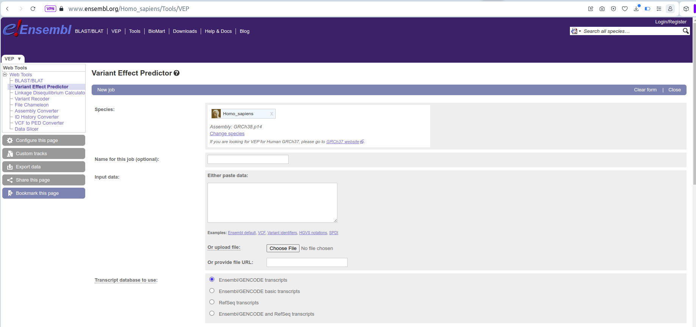
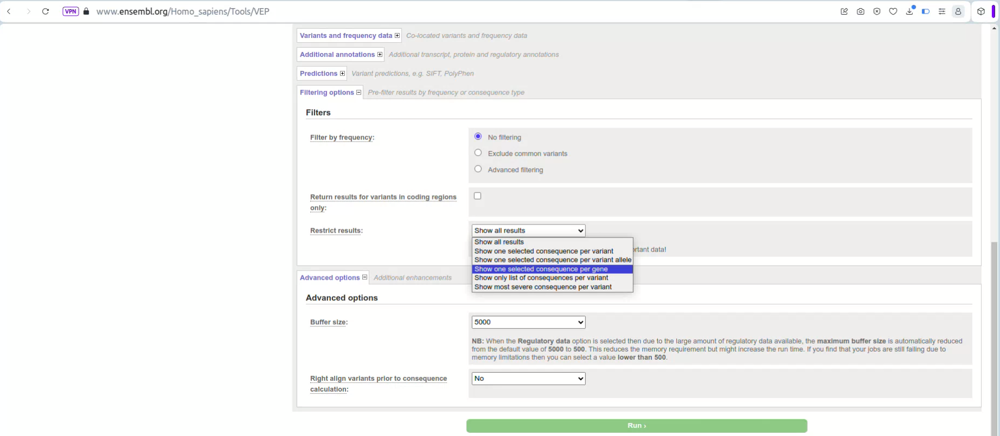
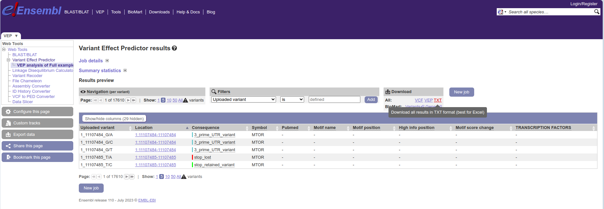

# omega
dN/dS analysis


## Installing
```
conda create -n omega python=3.10.12
conda activate omega
conda install conda-forge::libcurl
git clone https://github.com/bbglab/omega.git
cd omega
git checkout dev/package
pip install .
```

## Run preprocessing

### Input

### Modes
#### Mutabilities generation modes
The only difference when running omega in one mode or another is in generating the mutabilities file(`omega preprocessing`). For the downstream step (`omega estimator`) there is no difference.


##### OmegaLoc
`absent-synonymous` has value `ignore`

```
omega preprocessing --preprocessing-mode compute_mutabilities \
                    --depths-file P19_0044_BDO_01.tsv.gz \
                    --mutations-file P19_0044_BDO_01.mutations.tsv \
                    --input-vep-postprocessed-file consensus.exons_splice_sites.tsv \
                    --mutabilities-table mutability_per_sample_gene_context.P19_0044_BDO_01.tsv \
                    --table-observed-muts mutations_per_sample_gene_impact_context.P19_0044_BDO_01.tsv \
                    --mutational-profile P19_0044_BDO_01.all.profile.tsv \
                    --single-sample P19_0044_BDO_01 \
                    --absent-synonymous ignore
```


##### OmegaGlobalLoc
`absent-synonymous` has value `infer_global_custom`

```
omega preprocessing --preprocessing-mode compute_mutabilities \
                    --depths-file P19_0044_BDO_01.tsv.gz \
                    --mutations-file P19_0044_BDO_01.mutations.tsv \
                    --input-vep-postprocessed-file consensus.exons_splice_sites.tsv \
                    --mutabilities-table mutability_per_sample_gene_context.P19_0044_BDO_01.gLoc.tsv \
                    --table-observed-muts mutations_per_sample_gene_impact_context.P19_0044_BDO_01.gLoc.tsv \
                    --mutational-profile P19_0044_BDO_01.all.profile.tsv \
                    --single-sample P19_0044_BDO_01 \
                    --absent-synonymous infer_global_custom \
                    --relative-synonymous-muts-file ~/cohort_syn.tsv
```

where `~/cohort_syn.tsv` contains at least these two columns:
```
GENE	SYNONYMOUS_MUTS
ARID1A	408.0
CDKN1A	64.0
CREBBP	506.0
EP300	320.0
FGFR3	67.0
...
```


### Issues

- When generating the omega estimator files with OmegaLoc, any gene without synonymous mutations will not have any output.
- When running omega estimator, if any of the 96 channels of CONTEXT>MUT is 0, because there is no possible site of that kind that can generate a mutation of the impact that is being analyzed, those channels will be discarded see [#22](https://github.com/bbglab/omega/pull/22). (this is particularly frequent for nonsense and essential_splice impacts)


# __TO BE UPDATED__


## Run preprocessing
`$ python src/preprocessing/preprocessing.py test/input.json`

## Input
- File with somatic mutations:
    - Format:
        - The file should contain at least these 5 columns: CHROM, POS, REF, ALT, SAMPLE_ID

- Depths:
    - Format:
        - The first two columns of the file have to be informing about the chromosome and the position.
        - The next columns must have the name of the sample in the header and for each row, the corresponding value of depth in that chromosome and position.
        - Positions without coverage have to be filled with 0s.

- File defining the regions/sites where you want to focus the analysis:
    - BED file defining the regions sequenced: **(always do this in the first run)**
    This will make the execution start from the beginning and generate a file with all possible sites that will need to be annotated by VEP.
        - Format: BED6-like (not BED12)
        - The start and the end of the intervals are included as part of the analysis.

    - VEP output file:
        - This must be the file downloaded from Ensembl VEP execution using as input the file of all possible sites created by the `omega` preprocessing module, otherwise the downstream steps might not work.

    - VEP annotated sites postprocessed:
        - If you have already run the full preprocessing, this is the file that you should keep and then as long as you do not change the regions where you focus the analysis you can keep using this same file.
        - You could try to generate this file (see test/output/preprocessing/*.annotation_summary.tsv) or a file with the same information but the easiest way to proceed is to run the `omega` preprocessing module.


Make sure that the chromosome names are defined in the same way across the three files. For safety reasons, the "chr" prefix is enforced in all the three files.


### Running Ensembl VEP

1. Take the file provided by omega preprocessing module.

2. Upload it to the server see here.



3. Select EnsemblVEP parameters:
    - Leave everything as default except for the options to choose which variants to output. (see picture below)



4. Download the results, back to your computer/cluster



**NOTE:** If you are using a HPC clusterAlternatively you can right click on this button and copy the link. Then use `wget` to download the file directly to your desired location in the cluster, like this:

    wget "https://www.ensembl.org/Homo_sapiens/Download/Tools/VEP?format=txt;tl=....." -O regions_sites.VEP_annotated.tsv


5. Ideally, you could provide the full path to this file back to the omega preprocessing execution that will be waiting for this. __BUT RIGHT NOW it is not possible: SEE BELOW__

The user needs to do the following:
TODO: Document this or add some subprocess commands to do it in bash
this requires a bit more of preprocessing in bash:
See here:
```
$ cd DIRECTORY_WITH_THE_FILE
$ zcat Exome.no_header.tab.gz | cut -f 1,7,18 | awk '$3!="-"' | gzip > Exome.no_header.min_columns.tab.gz
$ zcat Exome.no_header.min_columns.tab.gz | tail -n +2 | awk -F'\t' 'BEGIN {OFS = "\t"} {split($1, a, "[_/]"); print a[1], a[2], a[3], $2, $3}' | gzip > Exome.no_header.min_columns.processed.no_labels.tab.gz
```
This is just an example, but you should follow it in order to get a dataframe with the following format/order and without header:

`
all_possible_sites[['CHROM', 'POS', 'REF', 'ALT', '#Uploaded_variation',                                            'Consequence', 'SYMBOL', 'MUT']]`

__THIS WILL BE CORRECTED SOON__


## Estimator

### How to run
`$ python src/estimator/main.py --option bayes --cores 2 test/input_estimation.json test/output_estimation_bayes.tsv`

### Options
`--option` admits the values `bayes` or `mle`, depending on the type of fitting

`--cores` how many cores to use by the parallel processing

### Input
The input is given as a single json dictionary with keys pointing to the required paths. 

*Depths*

- Format: the first two columns of the file have to be informing about the chromosome and the position; the next columns must have the name of the sample in the header and for each row, the corresponding value of depth in that chromosome and position.
- Positions without coverage have to be filled with 0s.

*VEP annotated sites*

File downloaded from Ensembl VEP execution using as input the file of all possible sites created by the `omega` preprocessing module, otherwise the downstream steps might not work.

*Regions*

File defining the regions/sites where you want to focus the analysis:
- BED file defining the regions sequenced
- Format: BED6-like (not BED12)
- The start and the end of the intervals are included as part of the analysis.

*Observed mutation counts*

- Mutation counts per sample, gene, impact and trinucleotide context
- This file has been generated by the preprocessing step

*Mutabilities*

- Absolute mutability per sample, gene and trinucleotide context
- This file has been generated by the preprocessing step

*Grouping dictionaries folder*

- The folder containing the grouping dictionaries to specify the grid that the execution will go through.
- The grouping dictionaries are dictionaries establishing value groups. The analysis grid -- all the sample, gene, impact combinations that we want to consider -- will take into account the value groups described in these dictionaries.
- Three dictionaries must be given: `group_samples.json`, `group_genes.json`, `group_impacts.json`

### Output
The output will be a single table will the estimates per each item analyzed from the grid.

The columns specifying the grid will be identical, 

`gene`, `sample`, `impact`

but the columns specifying the estimates coming out of each method will differ:

**bayes**

`mean_dnds`, `perc_25_dnds`, `perc_75_dnds`

**mle**

`dnds`, `lower_bound`, `upper_bound`, `pvalue`, `learning_curve`

